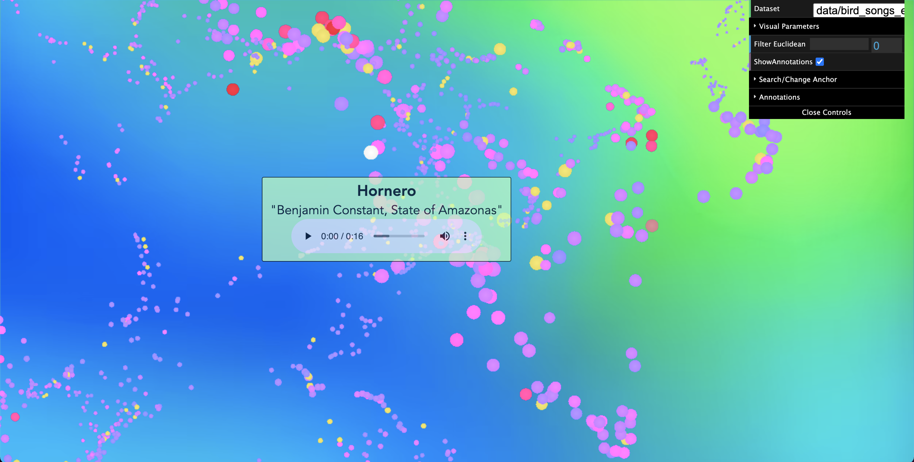

# GainForest EcoHackathon - Team: Acoustic Biologists 🦜

[](image/AppImg.png)  

**Check out the app here**: [https://harryhancock.github.io/PolyGlot_AcousticBiologists/](https://harryhancock.github.io/PolyGlot_AcousticBiologists/)

This hackathon project is an extension of the Polyglot app, part of the PolyPhy toolkit of network-inspired data science tools (for background on the PolyPhy hub, see [here](https://github.com/PolyPhyHub)). We modify the original app to display a point cloud of bird songs data (with audio playback available!

# Background and Methodology
[](image/Data_Pipeline.jpg) 
Functionally, the app enables domain experts to better understand the representation space of bioacoustic samples. In particular, we compute 128-dimensional vector representations of birds songs from the Amazon rainforest using the MFCC coefficients. Of course, such a representation space is impossible for humans to visualize. Instead, we rely on UMAP to create 3D vector representations, which are displayed in an interactive point cloud. However, embedding methods cannot preserve all the information in the original high-dimensional space. Thus, we rely on the notion of "anchor points" to recover some of the information from the high-dimensional space. Read on for a deeper dive into anchor points!

## Anchor Points and Recovering High Dimensional Information
[](image/Anchor_Points_Explainer.jpg) 
Anchor points are a randomly-chosen subset of the original dataset. For each of these points, we take their 128-dimensional vector representation and compute the Euclidean similarities between that anchor point and every other point in the dataset. 

Let's get a little more concrete. Denote the entire dataset of 128-dimensional vectors as \{D\} and our set of anchor points as \{A\}.
```
For each anchor point p in {A}
   For each point x in {D - p}  #ie., the entire dataset except the current anchor
      Compute euclidean_dist(p, x)
```
In our case we had roughly 3500 points in total and just 350 anchor points. Thus, we end up computing the Euclidean distance roughly 350 * 3499 = 1,224,650 times!

So, what's the point of this? Well, in the app, users can actually switch between any anchor point. On a particular anchor point, the entire 3D point cloud is colored such that points with high Euclidean similarity to the anchor point are brighter (red/pink) and the points with lower Euclidean similarity to the current anchor point are darker (purple/blue). In other words, users can see exactly where the most similar points (the bright red/pink) are in the embedding. This lets us peak into the mystical 128-dimensional space, all while remaining in our comfortable 3D universe!

# How to Use & Features
### 1. Double click any anchor point (yellow points) to change the anchor (you will see the rest of the point cloud change color).


### 2. If you find a point you want to listen to, hit <kbd>Control</kbd> to freeze the tooltip in place. Hit <kbd>Control</kbd> again to go back to hovering. *Note:* If the tooltip does not go away after pressing <kbd>Control</kbd>, try clicking outside of the play/pause button first and hitting <kbd>Control</kbd> again.
   


### 3. Press and hold <kbd>Shift</kbd> to see only the anchor points (all other points are white). If you wish to disable this feature (e.g., to take a screenshot) go to "Visual Parameters" > Dim When Shift and uncheck the box.


### 4. In case of colorblindness or trouble disinguishing the colors in the point cloud, you can also use the "Filter Euclidean" slider to filter out least similar points (so only the most similar will be visible)


### 5. Open the "Search/Jump to Anchor" folder to search for any species you'd like. The "Zoom to Point" dropdown will let you change the center of the point cloud to the point you choose (just zoom in and you will see it in green!). The "Select Anchor" dropdown is just another way to change the anchor point (in case you do not know the location of your desired point and cannot double click it).


## Authors
This version of Polyglot was extended as part of the Acoustic Biologist's team submission to the GainForest Ecohackathon in 2024. 

### Original Credits
This version of Polyglot was extended as part of Kiran Deol's 2023 Google Summer of Code project, mentored by [Oskar Elek](http://elek.pub) and [Jasmine Otto](https://jazztap.github.io) and is hosted as part of PolyPhy hub of bio-inspired data science tools.

This web visualization tool was originally created by a team of researchers at University of California, Santa Cruz, Dept. of Computational Media:
- [Hongwei (Henry) Zhou](https://normand-1024.github.io/)
- [Oskar Elek](https://elek.pub/)
- [Angus G. Forbes](https://creativecoding.soe.ucsc.edu/angus/)

This work was published as Hongwei Zhou's [M.S. thesis](https://escholarship.org/uc/item/6zj1r9ch#main).

A version of the original work was published in [2020 IEEE 5th Workshop on Visualization for the Digital Humanities (VIS4DH)](https://www.computer.org/csdl/proceedings-article/vis4dh/2020/915300a007/1pZ0Xs0EEqk)
