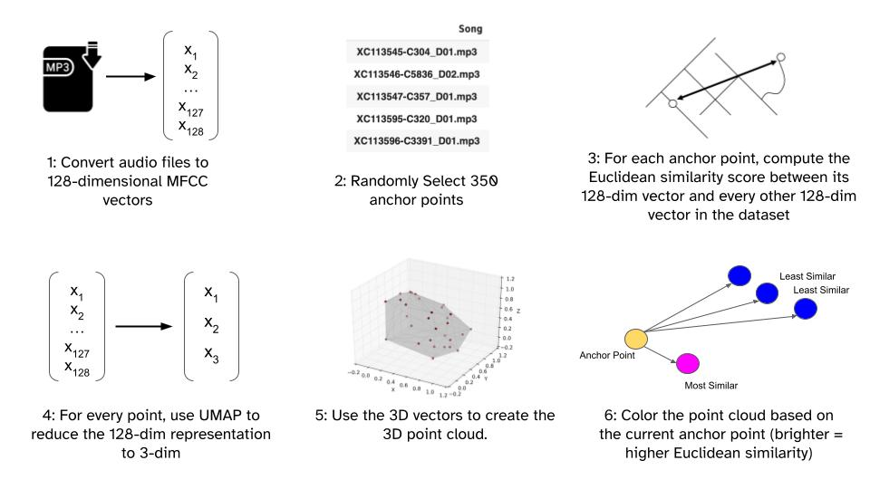
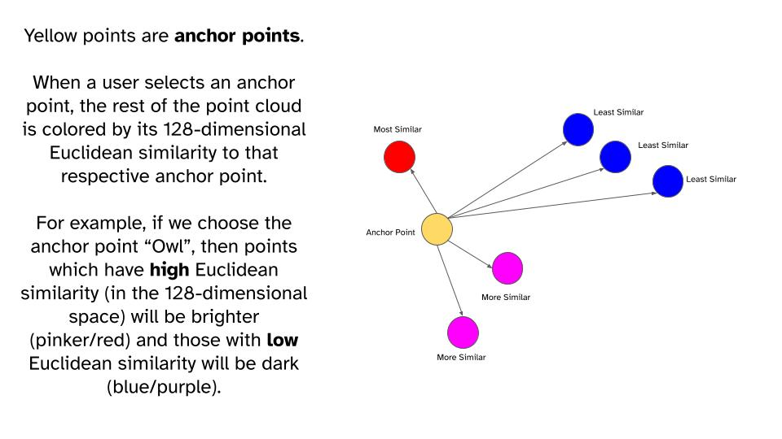

# Gainforest EcoHackathon - Team Acoustic Biologists 🦜

  

**Link to app**: [[https://polyphyhub.github.io/PolyGlot/]](https://harryhancock.github.io/PolyGlot_AcousticBiologists/)

This hackathon project is an extension of the Polyglot app, part of the PolyPhy toolkit of network-inspired data science tools (for background on the PolyPhy hub, see [here](https://github.com/PolyPhyHub)). We modify the original app to display a point cloud of bird songs data (with audio playback available!).

# Background and Methodology
 

 
# Features
1. Press <kbd>Control</kbd> to hold the tooltip in place (ie., so we can hit the audio play button). Hit <kbd>Control</kbd> again to go back to hovering. If it does not go away, try clicking outside of the tooltip and pressing <kbd>Control</kbd> again.

2. Press and hold <kbd>Shift</kbd> to see only the anchor points

3. Double click any anchor point (yellow point) to change the anchor (you will see the rest of the point cloud change color).
   
4. Fuzzy-text search bar and “jump to point” feature for smoother navigation

*Search feature. The point we have jumped to is highlighted in green.*

5. A grayscale mode

## Authors
This version of Polyglot was extended as part of Kiran Deol's 2023 Google Summer of Code project, mentored by [Oskar Elek](http://elek.pub) and [Jasmine Otto](https://jazztap.github.io) and is hosted as part of PolyPhy hub of bio-inspired data science tools.

This web visualization tool was originally created by a team of researchers at University of California, Santa Cruz, Dept. of Computational Media:
- [Hongwei (Henry) Zhou](https://normand-1024.github.io/)
- [Oskar Elek](https://elek.pub/)
- [Angus G. Forbes](https://creativecoding.soe.ucsc.edu/angus/)

This work was published as Hongwei Zhou's [M.S. thesis](https://escholarship.org/uc/item/6zj1r9ch#main).

A version of the original work was published in [2020 IEEE 5th Workshop on Visualization for the Digital Humanities (VIS4DH)](https://www.computer.org/csdl/proceedings-article/vis4dh/2020/915300a007/1pZ0Xs0EEqk)
